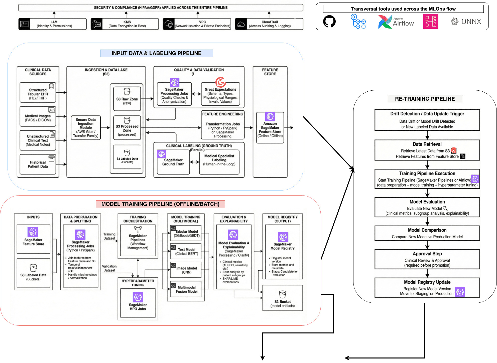
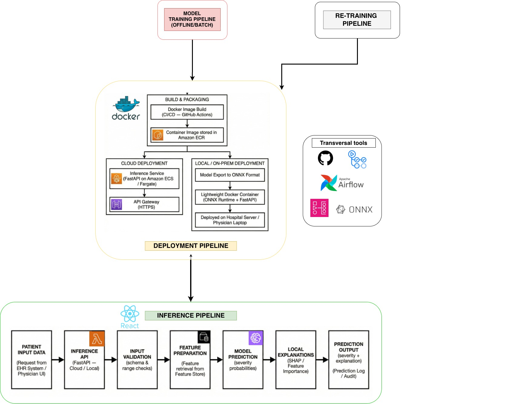

# MLOps Pipeline: Diagnóstico de Enfermedades Asistido por Machine Learning

 

### Autores
* **Andrés Felipe Cano Larrahondo**
* **Jhonattan Rafael Reales De La Asunción**
* *Universidad ICESI - Maestría en Inteligencia Artificial Aplicada*

---

## 1. Desafio Pipeline MLOps (sector salud)

### Contexto
En el contexto médico actual, la información de los pacientes ha crecido exponencialmente (historias clínicas, imágenes, notas), formando un ecosistema rico pero heterogéneo. Sin embargo, para patologías poco frecuentes (enfermedades huérfanas), la disponibilidad de datos es limitada, dificultando la creación de modelos robustos.

### Definición del Problema
El objetivo es desarrollar y operar un sistema inteligente de soporte a la decisión clínica capaz de predecir la probabilidad de que un paciente padezca una enfermedad y su nivel de severidad.

* **Usuario Final:** Médicos especialistas y hospitales.
* **Tarea de Predicción:** Clasificar al paciente en 5 niveles de severidad: *No Enfermo, Leve, Aguda, Crónica, Terminal*.
* **Reto Principal:** Manejar tanto enfermedades comunes (muchos datos) como huérfanas (pocos datos) bajo estrictas normas de privacidad y seguridad.

---

## 2. Diseño del Pipeline de Machine Learning

Para abordar este problema, se propone una arquitectura **End-to-End en AWS**, diseñada para soportar el ciclo de vida completo del modelo, desde la ingesta de datos heterogéneos hasta un despliegue híbrido (Nube y Local). Para información mas detallada del trabajo desarrollado, consultar el siguiente [archivo.](./archivos/informe_propuesta_mlops)

### Visión General de la Arquitectura
La solución se divide en dos principales macroflujos, **Ingesta/Entrenamiento** (offline) y **Despliegue/Inferencia** (online), los cuales a su vez, estan divididos en 4 pipelines principales:
- Pipeline de datos y etiquetado clínico
- Pipeline de entrenamiento y registro de modelos.
- Pipeline de despliegue e inferencia (cloud y local).
- Pipeline de monitoreo, detección de drift y reentrenamiento.

#### Sección 1: Datos, Calidad y Entrenamiento (Offline)
El siguiente diagrama detalla el flujo de datos, desde las fuentes clínicas (EHR, PACS) hasta el registro del modelo, pasando por validación de calidad y *feature engineering*.

**Herramientas Transversales:**
La arquitectura se sustenta en herramientas que operan a lo largo de todo el flujo para garantizar automatización y portabilidad:
* **GitHub & Actions:** Gestión de código y CI/CD.
* **Apache Airflow:** Orquestación de alto nivel de los flujos de datos y ML.
* **ONNX:** Estandarización del modelo para interoperabilidad entre Nube y Local.

**Componentes Clave del Flujo:**

1.  **Ingesta y Data Lake (S3):**
    * Almacenamiento seguro de datos crudos, procesados y etiquetados en Amazon S3.
    * Soporte para datos heterogéneos: tabulares (HL7/FHIR), imágenes (DICOM) y notas médicas.

2.  **Calidad y Etiquetado:**
    * **Validación:** Uso de *Great Expectations* y *SageMaker Processing Jobs* para asegurar esquemas y rangos fisiológicos válidos.
    * **Ground Truth:** *SageMaker Ground Truth* gestiona el etiquetado clínico con trazabilidad y procesos de *Human-in-the-loop*.

3.  **Feature Store:**
    * Centralización de variables (features) en *SageMaker Feature Store* para garantizar consistencia entre el entrenamiento y la inferencia (evitando *training-serving skew*).

4.  **Pipeline de Entrenamiento Multimodal:**
    * Estrategia que combina modelos especializados: Tabulares (XGBoost), Texto (Clinical BERT) e Imágenes (CNN).
    * Orquestación técnica mediante *SageMaker Pipelines* y *Airflow*.

5.  **Pipeline de Re-entrenamiento (Closed-Loop):**
    * **Trigger:** Se activa automáticamente ante alertas de **Drift** (de datos o de modelo) o llegada de nuevos datos etiquetados.
    * **Evaluación y Comparación:** El nuevo modelo (Challenger) es comparado contra el modelo en producción (Champion).
    * **Aprobación Clínica:** Incluye un paso de aprobación manual obligatorio por parte del equipo médico/técnico antes de actualizar el *Model Registry*.

---

#### Sección 2: Despliegue e Inferencia (Online/Híbrido)
El sistema implementa una estrategia de despliegue dual para adaptarse a la infraestructura heterogénea del sector salud, soportando tanto hospitales de alta complejidad como consultorios con conectividad limitada.

**1. Estrategias de Despliegue (Deployment Pipeline):**
Una vez registrado el modelo, el pipeline de CI/CD empaqueta la solución en dos modalidades distintas:

* **Modo Cloud (Microservicio Gestionado):**
    * El modelo se empaqueta en una imagen Docker almacenada en **Amazon ECR**.
    * Se despliega como un servicio **FastAPI** escalable sobre **Amazon ECS/Fargate** (Serverless).
    * La exposición es segura mediante **Amazon API Gateway** con autenticación (JWT/OAuth2) e integración con **AWS IAM**.
    * *Frontend:* Aplicación **React** alojada en S3 + CloudFront para consumo por parte de los médicos.

* **Modo Local / On-Premise (Baja Latencia y Privacidad):**
    * El modelo se exporta al formato estándar **ONNX** para maximizar la portabilidad.
    * Se genera un contenedor Docker "ligero" que incluye el **ONNX Runtime** y un servidor local FastAPI.
    * *Ventaja:* Permite la ejecución en servidores hospitalarios o laptops médicos sin necesidad de conexión a internet (offline), garantizando latencia mínima.

**2. Flujo de Inferencia (Inference Pipeline):**
Independientemente del modo de despliegue (Nube o Local), cada solicitud de predicción sigue un flujo riguroso para garantizar la validez clínica y la auditabilidad:

1.  **Recepción de Datos:** Entrada de datos clínicos desde el EHR o la UI del médico.
2.  **Validación de Entrada:** Verificación inmediata de esquema y rangos fisiológicos para rechazar datos anómalos.
3.  **Feature Preparation:** Consulta al **Feature Store** para enriquecer la data de entrada con variables históricas pre-calculadas.
4.  **Predicción del Modelo:** Generación de probabilidades para el tipo de enfermedad y clasificación en los 5 niveles de severidad.
5.  **Explicabilidad (XAI):** Generación de explicaciones locales (Feature Importance) usando SHAP/LIME para apoyar la decisión médica.
6.  **Auditoría:** Registro automático de *logs* de predicción y metadatos para trazabilidad completa.

---

## 3. Tecnologías implementadas

El stack tecnológico ha sido seleccionado minuciosamente para cumplir con los requisitos de **HIPAA/GDPR**, escalabilidad y operación híbrida.

| Servicio / Herramienta | Rol en el pipeline | Justificación |
| :--- | :--- | :--- |
| **Amazon S3** | Data Lake & Artefactos | Almacenamiento durable, económico y estándar para todo el ciclo de vida del dato. |
| **SageMaker Processing + Great Expectations** | Validación y Calidad | Permite jobs reproducibles y aplicación de reglas de calidad formales sobre datos sensibles. |
| **SageMaker Ground Truth** | Etiquetado Clínico | Facilita el etiquetado supervisado por médicos con trazabilidad y control de calidad. |
| **SageMaker Feature Store** | Gestión de Features | Garantiza consistencia de variables entre entrenamiento y producción (evita *training-serving skew*). |
| **SageMaker Pipelines** | Orquestación ML | Pipelines declarativos, reproducibles y auditables nativos para AWS. |
| **SageMaker Model Registry** | Gobierno de Modelos | Asegura trazabilidad de versiones, métricas y facilita la promoción a producción. |
| **AWS ECR + ECS/Fargate** | Contenedores Cloud | Ejecución *serverless* del microservicio de inferencia con escalabilidad automática. |
| **API Gateway + HTTPS/TLS** | Exposición Segura | Control de acceso, *throttling* y cifrado en tránsito para proteger la API clínica. |
| **Frontend React + S3/CloudFront** | Interfaz de Usuario | Entrega rápida y segura de la UI para los médicos con baja latencia. |
| **ONNX Runtime + Docker Local** | Inferencia On-Premise | Permite ejecutar el modelo en hospitales sin internet, manteniendo portabilidad. |
| **MWAA (Airflow)** | Orquestación General | Coordinación de flujos batch (ETL, monitoreo) mediante DAGs reprogramables. |
| **CloudWatch + Model Monitor** | Monitoreo | Visibilidad centralizada de logs, latencia y detección de *drift* en producción. |
| **AWS CloudTrail** | Auditoría | Soporte regulatorio (HIPAA) con trazabilidad de quién hizo qué y cuándo. |
| **IAM + VPC + KMS** | Seguridad Transversal | Obligatorio para datos clínicos: *least privilege*, aislamiento de red y cifrado *end-to-end*. |
| **GitHub + GitHub Actions** | CI/CD | Integración continua, pruebas automáticas y despliegue controlado a AWS. |

---

## 4. Cómo ejecutar la propuesta (Simulación)

Contamos con un [segundo repositorio](https://github.com/jhonattanreales21/ml-med-app-mlops-U2) en el cual se encuentra un trabajo en progreso de lo aqui planteado. Vale la pena aclarar que es una prueba de concepto minima. Este repositorio cuenta con una serie de pasos para ejecutar la aplicación via contenedores de docker.

---

## 5. Escenarios Futuros y Escalabilidad

La arquitectura está diseñada para evolucionar según nuevos requerimientos:

1.  **Predicciones en Tiempo Real (<3s):** La infraestructura en ECS/Fargate permite auto-escalado horizontal para manejar picos de demanda en hospitales grandes.
2.  **Feedback del Usuario (Médico):** Se implementará un *loop* de retroalimentación donde el médico pueda confirmar o corregir el diagnóstico sugerido, datos que se usarán para el reentrenamiento futuro.
3.  **Federated Learning:** Para mejorar la privacidad en enfermedades raras, se podría explorar entrenamiento federado sin mover los datos de los hospitales.

